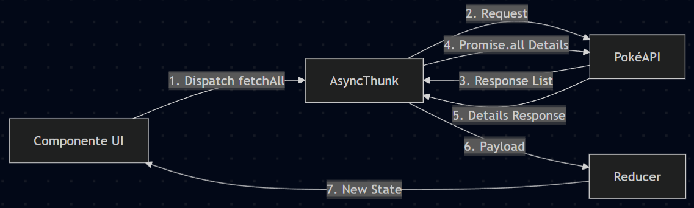
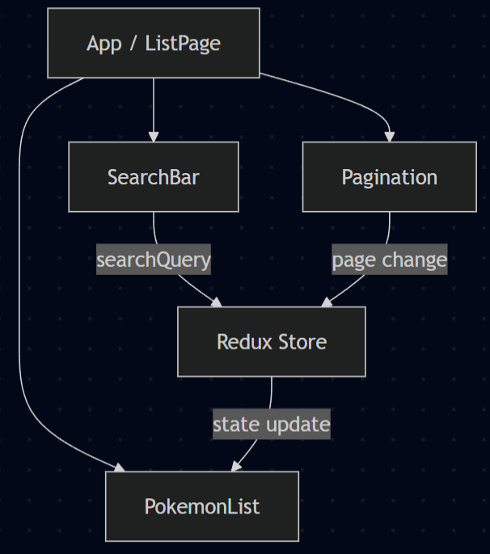

# Pokémon Finder - Prueba Técnica Fullstack

Esta es una aplicación desarrollada con React que permite visualizar y buscar Pokémones utilizando la PokéAPI. El proyecto cumple con los requisitos técnicos de paginación, búsqueda funcional y diseño responsivo.

## Requisitos del Sistema

Para garantizar el funcionamiento correcto de la aplicación, se recomienda contar con el siguiente entorno:

- Node.js: Versión 22 (seguir archivo .nvmrc)

- Gestor de paquetes: npm versión 9.0.0 o superior.

- Navegador: Base Chromium, Firefox o Edge actualizado (soporte para CSS Grid y Flexbox).

## Instrucciones para correr localmente

Sigue estos pasos para ejecutar la aplicación en un entorno local:

1. Clonar el repositorio:

```
git clone https://github.com/leandrodzn/pokeapi-frontent-test.git
cd pokeapi-frontent-test
```

2. Instalar dependencias: Este proyecto utiliza npm como gestor de paquetes.

```
npm install
```

3. Iniciar el servidor de desarrollo:

```
npm run dev
```

La aplicación estará disponible en http://localhost:5173.

## Tecnologías utilizadas

- React + Vite: Para un entorno de desarrollo rápido y moderno.

- TypeScript: Para garantizar la calidad y robustez del código.

- Redux Toolkit: Gestión del estado global de los Pokémon y la paginación.

- Tailwind CSS: Para una interfaz de usuario moderna y plataforma responsiva.

- Axios: Para el consumo eficiente de la PokéAPI.

## Scripts Disponibles

- **npm run dev**: Inicia el servidor de desarrollo.

- **npm run build**: Compila la aplicación para producción en la carpeta /dist.

- **npm run lint**: Ejecuta ESLint para asegurar que se cumplen las buenas prácticas de código.

## Documentación del Proyecto

### Documentación Funcional

La aplicación ha sido diseñada para ofrecer una experiencia de usuario fluida y eficiente, cumpliendo con los siguientes puntos:

- Interfaz orincipal: Presenta el nombre del desarrollador, una barra de búsqueda prominente, una cuadrícula de 6 personajes y controles de navegación.

- Sistema de búsqueda dinámica: Los usuarios pueden buscar Pokémon por su nombre exacto o términos similares. Usando filtrado inteligente, los resultados se actualizan en tiempo real.

- Navegación por páginas: La visualización está limitada a 6 Pokémon por pantalla para evitar la sobrecarga de información. El sistema de paginación permite explorar todo el catálogo de forma ordenada, avanzando o retrocediendo de página de acuerdo a la cantidad de resultados y disponibilidad.

- Diseño responsivo: La plataforma es totalmente adaptable, garantizando una visualización correcta tanto en dispositivos móviles como de escritorio.

### Documentación Técnica

El desarrollo se basó en estándares modernos de la industria para asegurar un código limpio y escalable:

- Arquitectura de estado: Se implementó **Redux Toolkit** para gestionar el estado global, permitiendo una sincronización perfecta entre el buscador y la lista de Pokémon.

- Lógica asíncrona: Se utilizó **createAsyncThunk** junto con **Axios** para el consumo de la PokéAPI. Se optimizó la carga de datos realizando peticiones paralelas (Promise.all) solo para los elementos visibles en pantalla.

- Optimización de API: Debido a que la PokéAPI no tiene búsqueda parcial nativa, se implementó una lógica que descarga un conjunto de datos mayor cuando existe una consulta activa, permitiendo la búsqueda de "similares" sin sacrificar el rendimiento, ya que solo se solicitan los detalles (imagen) de los 6 resultados visibles.

- Hooks de React: Se implementaron

  - **useState** para el manejo del input de búsqueda
  - **useEffect** para sincronizar las peticiones a la API con el cambio de página y filtros
  - **useRef** para debounce en la búsqueda permitiendo una consulta automática

- TypeScript: El proyecto utiliza TypeScript para el tipado estricto de los datos de la API y la comunicación entre componentes, minimizando errores y mejorando la mantenibilidad.

- Path Aliasing: Se configuraron alias (@/) para mejorar la legibilidad y mantenimiento de las rutas de importación.

## Visualización de Arquitectura

### Diagrama de Flujo de Datos

Este diagrama detalla el ciclo de vida asíncrono implementado para la gestión de datos:

- Gestión asíncrona: Se utiliza createAsyncThunk para realizar peticiones a la PokéAPI, permitiendo manejar estados de carga, éxito y error.

- Optimización de carga: En lugar de realizar peticiones secuenciales, el flujo utiliza Promise.all para obtener los detalles e imágenes de los 6 Pokémon en paralelo, reduciendo significativamente el tiempo de respuesta de la interfaz.

- Sincronización del estado: El reducer procesa la información final y actualiza el Store, lo que dispara una re-renderización automática en los componentes suscritos, garantizando que la interfaz tiene los datos más recientes.



### Diagrama de Arquitectura de Componentes

Representa la jerarquía y organización modular de la aplicación siguiendo el layout solicitado:

- Desacoplamiento de lógica: La aplicación se divide en componentes especializados (SearchBar, PokemonList, Pagination), facilitando el mantenimiento y la legibilidad del código.

- Comunicación vía Store: Se evita el "Prop Drilling" utilizando Redux como única fuente de verdad. El SearchBar y la Pagination despachan acciones al Store, mientras que el PokemonList (Contenido) reacciona a esos cambios para mostrar el los pokemones correctamente.

- Escalabilidad: Esta estructura permite cumplir con la responsividad, ya que cada componente puede ajustar su estilo de forma independiente mediante Tailwind CSS o CSS puro sin afectar la lógica global.



## Autor

Leandro Dzib
